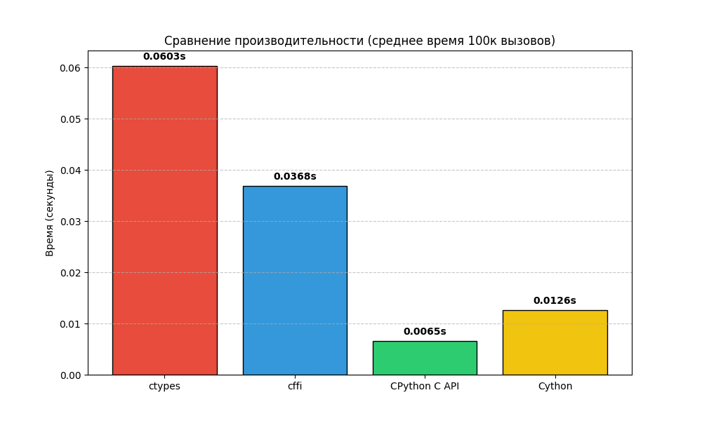

# Лабораторная работа №5: Интеграция C и Python

Данный проект посвящен исследованию различных способов взаимодействия Python с кодом на языке C на примере вычисления полинома $P(x) = a_0 + a_1x + a_2x^2 + \dots + a_nx^n$.

## Структура проекта

  * `c_core/` — реализация вычислительной логики на языке C (алгоритм Горнера).
  * `python_ctypes/`, `python_cffi/`, `python_capi/`, `python_cython/` — реализации четырех способов вызова C-функции.
  * `benchmark/` — скрипты для генерации 100 000 наборов данных и проведения 50 циклов замеров производительности.

## Результаты тестирования

По итогам 50 запусков (в каждом по 100 000 вызовов с уникальными данными) были получены следующие показатели времени выполнения (в секундах):

| Подход | Min | Max | Mean (Среднее) | Median | Std |
| :--- | :--- | :--- | :--- | :--- | :--- |
| **ctypes** | 0.0585 | 0.0621 | 0.0597 | 0.0596 | 0.0008 |
| **cffi** | 0.0370 | 0.0403 | 0.0383 | 0.0380 | 0.0009 |
| **CPython C API** | 0.0064 | 0.0150 | **0.0070** | 0.0066 | 0.0016 |
| **Cython** | 0.0125 | 0.0141 | 0.0130 | 0.0130 | 0.0003 |

-----

### Визуализация

-----

## Анализ и выводы

1.  **Самый быстрый способ:** **CPython C API**. Среднее время выполнения составляет всего $0.0070$ сек. Это объясняется минимальными накладными расходами: преобразование типов происходит на низком уровне, а вызовы функций практически идентичны прямым вызовам в C.
2.  **Самый медленный способ:** **ctypes** ($0.0597$ сек). Причина в динамическом характере библиотеки: Python вынужден выполнять поиск функции в библиотеке и осуществлять дорогостоящую упаковку/распаковку типов (marshaling) при каждом из 100 000 вызовов.
3.  **Самый простой в реализации:** **ctypes**. Он не требует компиляции отдельного Python-модуля или написания сложного оберточного кода на C — достаточно загрузить `.so` файл.
4.  **Наиболее удобный для сопровождения:** **Cython**. Его синтаксис максимально близок к Python, что упрощает чтение кода, при этом он показывает производительность, близкую к чистому C API, за счет автоматической генерации оптимизированного кода обертки.

-----

## Инструкция по запуску

1.  Скомпилировать C-ядро: `gcc -fPIC -shared -o libpoly.so c_core/poly.c`.
2.  Собрать модули расширения: запустите `setup.py` в папках `python_capi` и `python_cython`.
3.  Запустить тесты: `python3 benchmark/benchmark.py`.
4.  Сгенерировать график: `python3 benchmark/plot_results.py`.
